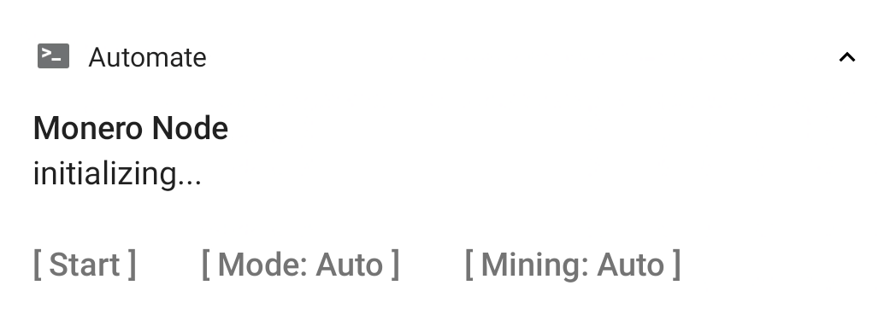
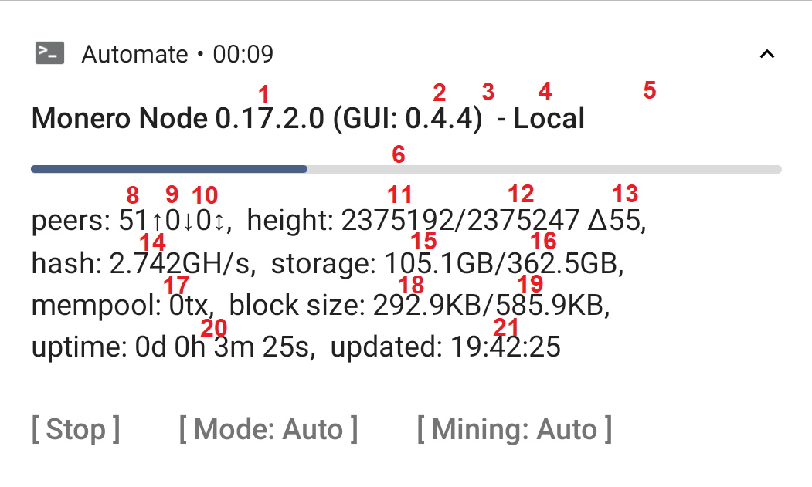

# Monero Node GUI for Android

Monero is the world's leading private cryptocurrency. It's network is made up of many independent Nodes, which share and verify blockchain and transaction data (P2P server) and provide wallet services to light/mobile wallets (RPC server). Each additional node improves speed, stability and decentralization of the entire system, so running your own node is a great way to contribute to the project. Additionally it will improve your sync speed of your mobile wallet and improve your privacy!

Typically nodes are either installed on home computers or dedicated servers. Both methods have drawbacks: Running a node on your home computer 24/7 can be inconvenient because of noise, a higher power consumption or the specific work you do. Renting a server is a lot more expensive, somewhat centralized and can be intimidating to setup. All those issues can be solved with a cheap, low power dedicated computing device...
<br>

---

<br>

I investigated single board computers like the RaspberryPi 4B and others, which are a lot better in many aspects, but can become quite expensive with all accessories needed. Then it hit me:

**Let's use Android phones as a nodes!**

It turns out the idea isn't new, the first build dates back to [13 Apr 2017](https://www.reddit.com/r/Monero/comments/651un2/monero_v01031_cli_for_android_arm64/), but until now there was no good installation guide you could only interact with the node through the command line, which is very inconvinient on a phone.

This project is aimed at making nodes on phones more accessible to the avarage user. More nodes improve the network strength and phones in particular have the following benifits compared to other options:

- it's insanely cheap and environment friendly:
	- works on old, otherwise unused phones, even if the battery is dead and the screen cracked - **$0**
	- re-use the old and slow charger that came with the phone and its generic cable - **$0**
	- microSD slot can be used to upgrade memory, [200GB](https://www.amazon.com//dp/B08HCHS64Y/) cost as little as **$25**
	- it consumes only about 3W, roughly 2kWh/month or **<$0.30/mo**
- better than RaspberryPi 4B
	- typically 4+ CPU cores with native AES support
	- eMMC memory for the OS - all SD bandwidth is available for the node
	- optimized for high efficiency/ low power consumption
- build-in bonus features:
	- WiFi + 4G dual network
	- backup battery, so you can unplug & move the device without downtime
	- build-in screen, no external screen/terminal needed

---

**NOTE: This is a pre-release version. Please DO NOT SHARE THE LINK AND/OR ANY CONTENT FROM THIS REPO just yet. There will be a public post on reddit within the next few days after which you can use this as you like.**

## Features

- step-by-step installation guide
- notification with current status & action buttons
- automatic shutdown & resume when power cycle (WIP)
- automatic start/stop based on (WIP)
	- charger connected?
	- wifi connected?
	- low battery?
	- airplane mode?
- highly customizable configuration
- optional solo mining (WIP)


## Requirements

Hardware:

- Android 7.0 or later
- CPU with ARMv8 or ARMv7 core
- 3GB+ RAM  (2GB not tested yet)
- micro SDXC card slot (or 128GB+ internal memory)
- working WiFi (or unlimited mobile data)

Accessories:

- 1x microSD with 128GB+ (Class 10/ U1 speed or better)
- 1x USB charger (5V2A+)
- 1x USB cable


*Because the Monero Node has fairly low requirements it is a great way to re-purpose otherwise unused hardware. For best performance see the "Hardware Optimization" section below.


## Installation

### Preparation

On old phones the latest security update is often many years old. For running a node this is not a problem, but it's always a good idea to reduce attack surface.

Many popular devices have 3rd party custom roms with more recent updates. Consider installing one if you have the skill. Make sure SELinux is set to strict for best security.

In any case I recommend removing all user data, so that even if an attack is successful no data can be stolen: 

- download all user data from the device
- reset it to factory settings
- wipe empty space by writing random data to it, eg. with [RandomFileMaker](https://f-droid.org/packages/io.github.randomfilemaker/)

The following guide assumes that you have set up the microSD card as "external storage". If it is configures as "expand app space" I recommend to backup all data, format the card and re-insert it.

Technically you can also use the internal storage or external storage configured as "expand app space", but you'll need to change file paths manually which I did not test yet.


### Install Apps

First, install the following apps. For CLI-only operation you only need Termux.

1. **[F-Droid](https://f-droid.org/FDroid.apk):**
Alternatively you can download the apks directly from their website, but then you have to update apps manually.<br><br>
2. **[Termux](https://f-droid.org/packages/com.termux/):**
Termux runs the pre-compiled `monerod` application and is essential even if you don't want the GUI.<br><br>
3. **[Termux:Tasker](https://f-droid.org/packages/com.termux.tasker/):**
A plugin to interface tasker with external tools.<br><br>
4. **[Aurora Store](https://f-droid.org/de/packages/com.aurora.store/)** or Google Play:
The GUI is build in "Automate" which is not available on F-Droid :(.<br><br>
5. **[Automate](https://play.google.com/store/apps/details?id=com.llamalab.automate):**
A flowchart based scripting tool for android. The GUI and the automatic actions are implemented with an Automate script. The free version is sufficient. DISABLE AUTOMATIC UPDATES, otherwise it interrupts the script and requires a manual restart.<br>


### Install monerod

Next you need to install the CLI version of monerod with Termux.  The instructions were originally published by some anon on https://pastebin.com/7mQUW2qY and I slightly modified them for this guide. In particular, monerod MUST be installed to .termux/tasker/monero-cli/

**Option 1:** Automatic install. Copy the following line, tap and hold anywhere in the termux terminal, select "paste" and hit enter. You may need to confirm halfway through the process by typing `y` + Enter. When installation is complete it will show "INSTALLATION OF MONEROD IS COMPLETE."

```
termux-setup-storage && pkg update -y && pkg install wget -y && cd && mkdir -p .termux/tasker && cd .termux/tasker && wget -O monero.tar.bzip2 https://downloads.getmonero.org/cli/androidarm8 && tar jxvf monero.tar.bzip2 && rm monero.tar.bzip2 && rm -rf ~/monero-cli && mv monero-a* monero-cli && mkdir -p ~/storage/external-1/bitmonero && echo INSTALLATION OF MONEROD IS COMPLETE. You can close Termux now.
```

**Option 2:** Automatic install with QR code. Just scan it to get the data above quickly to your phone, tap and hold anywhere in the termux terminal, select "paste" and hit enter. You may need to confirm halfway through the process by typing `y` + Enter. When installation is complete it will show "INSTALLATION OF MONEROD IS COMPLETE."


**Option 3:** manual install. Instead of merging all commands into one, you can run them step by step.

```
# Based on "Monero on Android Full Node Install Guide v2.0 (https://pastebin.com/7mQUW2qY)"

## Install Guide:

# Allow Termux to access Android shared storage for storing the large node folder This might wipe your SD card. This command should open an android prompt to give the app permission.
# Ref: https://wiki.termux.com/wiki/Termux-setup-storage 
termux-setup-storage

# Update Termux, install necessary packages
pkg update -y
pkg install wget -y

# Download latest Monero Android ARMv8 build to Termux home folder, extract and delete the file.
cd
mkdir -p .termux/tasker
cd .termux/tasker
wget -O monero.tar.bzip2 https://downloads.getmonero.org/cli/androidarm8
tar jxvf monero.tar.bzip2
rm monero.tar.bzip2

# Rename extracted folder to something more usable
rm -rf ~/monero-cli
mv monero-a* monero-cli

# Create bitmonero folder in external SD folder. if for some reason, you aren't able to create this folder, try restarting the phone and running termux-setup-storage again.   
mkdir -p ~/storage/external-1/bitmonero
```

### Setup Config Files

Open your file explorer, go to the root of the internal storage (should have folders like "DCIM" or "Downloads") and create a new folder `monero-node`.

Copy into this folder the files `monero-node-gui.json`, `monerod.conf`, `monerod_p2p.conf` and `monerod_rpc.conf`. The .json file contains commands executed by the interpreter, you can edit almost everything in here, including file paths for the config files.

The config files are the standard config files for monerod. The provided files contain recommended settings and annotations, full description is available on https://monerodocs.org/interacting/monerod-reference/.

### Sideload Blockchain (optional)

If you have a copy of the blockchain on another device (eg. on your computer), you can copy to the microSD card to *greatly* speed up the synchronisation. Because of Android file access restrictions, you MUST copy it to `X:/Android/data/com.termux/files/bitmonero`

**Note:** If you ever uninstall Termux this folder is deleted by the android file system. If you want to keep if, move the folder *before* uninstalling termux to the root of the SD card. 

### Setup Automate

Download `Monero Node GUI.flo` and import it with with Automate. Before starting the script you'll need to grant permission to use Tasker. Access is limited to the /tasker folder we created earlier: 

Settings -> Privileges -> Run commands in Termux environment" com.termux.permission.RUN_COMMAND

Additionally, if you want automate to resume after shutdown enable:

Settings -> "Run on system startup"

Lastly, go back to the "Monroe Node" flow, tap the receipt icon in the top right corner and disable logging. This Script is very noisy and otherwise creates several MB of files per hour.

### Setup your Router (optional)

In order to participate in either the P2P or RPC network, you'll need  to open the ports in your router. P2P requires port 18080, restricted public RPC requires 18089. Exact procedure depends on the router you have, so you'll have to google that yourself.

## Usage

To start the GUI open Automate, select the "Monero Node GUI" flow and tap "start". Within a few seconds this notification should pop up:



Expand the notification by swiping down or by tapping the triangle in the top right corner. This reveals three action buttons:

- Start/Stop/Apply
- Mode: Auto/Local/P2P/RPC
- Mining: Auto/On/Off

With the Mode and Mining buttons you can cycle through the different options. The lable of the third button is context depended. If the Mode/ Mining setting has been changed *during* operation, this button is labeled "apply" and stops the node temporally and then re-starts it with the new settings.

While the code is buzy the action buttons are hidden to prevent accidental inputs, once the operation is complete they are shown again. Tapping the notification opens a menu with additional options, which is currently unused and only has placeholders.

Note that the GUI is only loosly coupled to the monerod CLI application. If you stop the flow from within automate, monerod *will not* be automatically stopped!

---

After starting the node, the notification content will be updated wihtin a minute or so. The content is intentionally narrow to work well on old devices with low resolution screens. It looks something like this:



It contains a lot of information at a glance:

1. **version of monerod** trailing tag only shown if other then "-release"
2. **version of the gui** this field my be removed in the future to reduce clutter
3. **stagenet/testnet label** only shown if used
4. **current mode** or config file loaded
5. **mining hashrate** only shown when mining
6. **synchronisation progress**, this shows how many blocks have been synced/ need to be synced *since the last start*; hidden when synchronisation complete
7. (number missing)
8. **outgoing connections**, the amount of nodes your node requests blockchain updates from
9. **incomming connections**, the amount of nodes that request blockchain updates from your node; should be 0 if P2P is disabled or port 18080 closed
10. **RPC connections** the amount of nodes that use your node as an RPC server; should be 0 if RPC is disabled or port 18081/18089 closed, unless a local wallet accesses it
11. **blockchain height local**
12. **blockchain height network**
13. **blockchain height delta**, the amount of blocks that need to be synced
14. **network hashrate**, some variation is normal, a large jump in either direction could indicate an attack by ie. a botnet
15. **storage used by blockchain** current locally used storage
16. **storage available for blockchain**, the sum of currently used space and free space. This value *decreases* when you copy other data to the storage medium
17. **mempool tx**, as reported by the RPC get_info command, a high value could indicate network congestion by ie. a spam attack
18. **median block size**, the minimum value is 292.9KB, an increase indicates that long term (24h+) usage grows
19. **maximum block size**, typically 2x the median block size, if it is less the network gets closer to it's maximum defined dynamic blocksize growth limit
20. **uptime**, as shown in the CLI, but currently *resets every time you change the config*
21. **last update** of the notification, typically updated every minute, but during sync or otherwise buzy monerod it may be significantly delayed. 


## Why Automate?

I acknowledge that it is an odd choice to implement a GUI in Automate. Here are my reasons for it:

- **Easy to use.** All UI elements match the Android standard and performance is sufficient.
- **Easy to verify.** Anyone, even a non-programmer, can verify that it does not behave maliciously
- **Easy to modify.** There's no compiler, no special tools, no complicated setup. Just add/ remove blocks/ variables/ text.
- **One for all.** Because automate abstracts from Android, the same script works on any Android device, no need for device specific fixes.

The downsides are:

- **Not Open Source.** It's the only part of this setup that is not open and although I'm personally fine with it, it may be off putting to you.
- **Free version has 30 blocks limit.** I wanted this to be available to as many people as possible and without forcing payment through google. To still pack in all the features I wanted, the script is highly optimized and contains an interpreter that can load most of the functionality from a .json config file. For an explanation how this works see next section.

If you are skilled with android app development, you are more than welcome to build a stand-alone app that performs the same or similar function.


## Interpreter

The Monero Node GUI uses Automate to control monerod through Termux and the Termux:Tasker plugin based on device conditions and a simple notification based UI.

One downside of Automate is that the free version works only with 30 blocks or fewer and the paid version is only available through Google Playstore. To implement all the features I wanted and stay within this limit, I build a simple interpreter, which reads instructions from an external .json config file and can re-use most blocks. This config file also provides great flexibility with minimum effort.

This documentation originated from my notes and briefly outlines how the interpreter works: [README_interpreter.md](README_interpreter.md)


## Hardware Optimization

(TODO)


## KNOWN BUGS:

- A single time during development Automate became really slow. Typical processing time per event increase from 10 fold. Restarting your device fixes this.
- Sometimes the action buttons in the notification don't show properly, even though the notification is expended. This is most likely an Automate bug. If it happens double tap the arrow in the top right corner to collapse the notification and expend it again.


## Other Platforms

If you'd rather run a node on a non-android device please check out these guides:

- Linux (Debian/Ubuntu), home server/ VPS: https://sethsimmons.me/guides/run-a-monero-node/
- RaspberryPi, Rock64, Odroid: https://github.com/monero-ecosystem/PiNode-XMR


