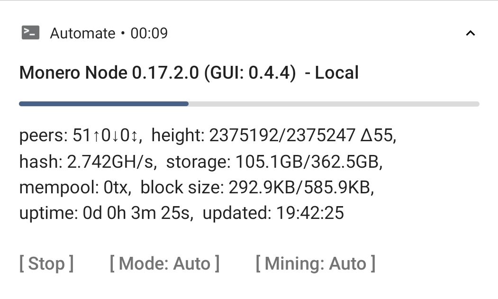
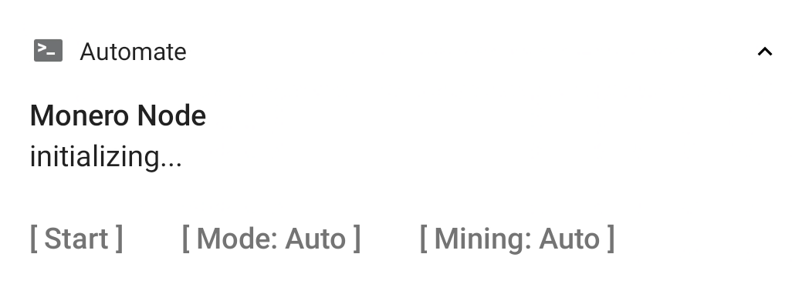
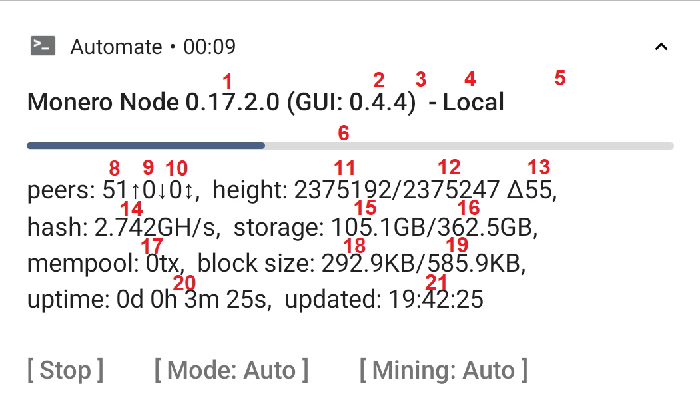

# Monero Node GUI for Android

Monero is the world's leading private cryptocurrency and needs a network of indevepended "nodes" to download and verify the blockchain, broadcast transactions and new blocks to other nodes (P2P) and optionally provice wallet services to light/mobile wallets (RPC).

Running a node by yourself improves your own privacy and greatly improves the synchronisation speed of your light/mobile wallets. If configured right, each additional node also improves speed, stability and decentralization of the entire system, which makes it a great way to contribute to the Monero network.

Typically nodes are either installed on dedicated servers, home computers or even a RaspberryPi. All methodes have drawbacks: setup costs, power consumption, complexity with installation/usage and noise, just to name a few.

---

This project offers you a new option: **Run a Full Node on an Android device!** Currently I'm primarily targeting last-generation phones which typically end up unused in a drawer somewhere, but once the automatic start/stop triggers are implemented, it'll be great on your daily driver as well!

The idea isn't new, the first build dates back to [13 Apr 2017](https://www.reddit.com/r/Monero/comments/651un2/monero_v01031_cli_for_android_arm64/), but until now there wasn't a good installation guide  and you could only interact with the node through the command line, which isn't particulary user friendly. So I took it on myself to make it more accessible to the avarage user, so that we can improve network strength and decentralization even further.

---

**NOTE: This is a pre-release version. Please DO NOT SHARE THE LINK AND/OR ANY CONTENT FROM THIS REPO just yet. There will be a public post on reddit after which you can use this as you like.**


## Features

- step-by-step installation guide
- notification with current status & action buttons
- automatic shutdown & resume when power cycle (WIP)
- automatic start/stop based on (WIP)
	- charger connected?
	- wifi connected?
	- low battery?
	- airplane mode?
- highly customizable configuration
- optional solo mining (WIP)


## Screenshot




## Requirements

Hardware:

- Android 7.0 or later
- CPU with ARMv8 core
- 3GB+ RAM  (2GB not tested yet)
- micro SDXC card slot (or 128GB+ internal memory)
- working WiFi (or unlimited mobile data)

Accessories:

- 1x microSD with 128GB+ (Class 10/ U1 speed or better)
- 1x USB charger (5V2A+)
- 1x USB cable


*Because the Monero Node has fairly low requirements it is a great way to re-purpose otherwise unused hardware. For best performance see the "Hardware Optimization" section below.

## Benefits

- it's insanely cheap and environment friendly
	- works on old, otherwise unused phones, even if the battery is dead and the screen cracked - **$0**
	- re-use the old and slow charger that came with the phone and its generic cable - **$0**
	- microSD slot can be used to upgrade memory, [200GB](https://www.amazon.com//dp/B08HCHS64Y/) cost as little as **$25**
	- it consumes only about 2W, roughly 2kWh/month or **<$0.30/mo**
- better than RaspberryPi 4B
	- typically 4+ CPU cores with native AES support
	- eMMC memory for the OS - all SD bandwidth is available for the node
	- optimized for high efficiency/ low power consumption
- build-in bonus features:
	- WiFi + 4G dual network
	- backup battery, so you can unplug & move the device without downtime
	- build-in screen, no external screen/terminal needed

**Cost Comparison:**

To give perspective on how ridiculous cheap this node is I want to compare it with other common options. For these calculation I estimated the idle power consumption and the power supply opperating at 75% at this load, this means device consumption of 1W ≈ 1kWh/mo. The price per kWh varies based on location, I chose $0.15 per 1kWh as a reasonable value.

| hardware | setup cost | running cost/mo | 1 year avg. /mo | 3 year avg. /mo | total 3 year cost |
| --- | --- | --- | --- | --- | --- |
| re-used old phone; bought microSD | $25 | $0.30 | $2.38 | $0.99 | $35.64 |
| re-used old notebook | $0 | $1.20 | $1.20 | $1.20 | $43.20 |
| re-used old desktop | $0 | $3.00 | $3.00 | $3.00 | $108 |
| bought second hand phone; bought microSD | $60 | $0.30 | $5.30 | $1.97 | $72.09 |
| bought RaspberryPi4 4GB incl. case power supply, heatsink; bought microSD | $75 | $0.60 | $6.85 | $2.68 | $96.48 |
| [xmrcannon.net](https://xmrcannon.net/info) | $0 | $32.85 | $32.85 | $32.85 | $1182.60 |
| [hetzner.com](https://www.hetzner.com/de/dedicated-rootserver/ax41-nvme) | $56.26 | $49.04 | $53.73 | $50.60 | $1821.60 |


## Installation

### 0. Preparation

On used phones the latest security update is often many years old. For running a node this is not a problem, but it's always a good idea to reduce attack surface.

Many popular devices have 3rd party custom roms with more recent updates. Consider installing one if you have the skill. Make sure SELinux is set to strict for best security.

In any case I recommend removing all user data, so that even if an attack is successful no data can be stolen: 

- download all user data from the device
- reset it to factory settings
- wipe empty space by writing random data to it, eg. with [RandomFileMaker](https://f-droid.org/packages/io.github.randomfilemaker/)

The following guide assumes that you have set up the microSD card as "external storage". If it is configures as "expand app space" I recommend to backup all data, format the card and re-insert it.

Technically you can also use the internal storage or external storage configured as "expand app space", but you'll need to change file paths manually which I did not test yet.


### 1. Install Apps

First, install the following apps. For CLI-only operation you only need Termux.

1. **[F-Droid](https://f-droid.org/FDroid.apk):**
Alternatively you can download the apks directly from their website, but then you have to update apps manually. You **MUST** use F-Droid for Termux and  Termux:Tasker because the Play Store version is [not updated anymore](https://www.xda-developers.com/termux-terminal-linux-google-play-updates-stopped/).<br>
2. **[Aurora Store](https://f-droid.org/de/packages/com.aurora.store/)** or Google Play:
The GUI is build in "Automate" which is not available on F-Droid :(. If you already have Google Play installed you can just use that<br>
3. **[Termux from F-Droid](https://f-droid.org/packages/com.termux/):**
Termux runs the pre-compiled `monerod` application and is essential even if you don't want the GUI.<br>
4. **[Termux:Tasker from F-Droid](https://f-droid.org/packages/com.termux.tasker/):**
A plugin to interface tasker with external tools.<br>
5. **[Automate from Aurora/ Play Store](https://play.google.com/store/apps/details?id=com.llamalab.automate):**
A flowchart based scripting tool for android. The GUI and the automatic actions are implemented with an Automate script. The free version is sufficient. DISABLE AUTOMATIC UPDATES, otherwise it interrupts the script and requires a manual restart.<br>
6. **[Binary Eye form F-Droid](https://f-droid.org/packages/de.markusfisch.android.binaryeye/) (optional):**<br>
If yu need a QR scanner, this is the best one. Any QR code scanner greatly simplifies the process


### 2. Install monerod

Next you need to install the CLI version of monerod with Termux.  The instructions were originally published by some anon on https://pastebin.com/7mQUW2qY and I modified them for this guide. In particular, monerod MUST be installed to .termux/tasker/monero-cli/

Copy the following code to the clipboard (or scan the QR code below), tap and hold anywhere in the Termux terminal, select "paste" and hit enter. You will be prompted to allow access to external storage, select "Allow" and press enter to continue the installation. Everything else is fully automatic. When installation is complete it will show "INSTALLATION OF MONEROD IS COMPLETE" and prompt you to import the flow into Automate.

```
export PT=~/.termux/tasker
export PI=~/storage/shared/monero-node
export PD=~/storage/external-1/bitmonero

termux-setup-storage && \
read -p "Press enter after confirming the storage permission." && \

echo $'\nUPDATING TERMUX' && \
yes | pkg update -y && \
pkg install wget git -y && \

echo $'\nDOWNLOADING MONEROD'
mkdir -p $PT && \
mkdir -p $PI && \
mkdir -p $PD && \
cd $PT && \
wget -O monero.tar.bzip2 https://downloads.getmonero.org/cli/androidarm8 && \
tar jxvf monero.tar.bzip2 && \
rm monero.tar.bzip2 && \
rm -rf monero-cli && \
mv monero-a* monero-cli && \
cd && \

echo $'\nDOWNLOADING REPOSITORY'
cd && \
rm -rf monero-node-android && \
git clone https://github.com/yeongno172/monero-node-android && \
cd monero-node-android && \
cp monerod.conf $PI && \
cp monero-node-gui.json $PI && \
cp monero-node-gui.flo $PI && \
cd && \
rm -rf monero-node-android && \

echo $'\nINSTALLATION OF MONEROD IS COMPLETE.' && \
termux-open $PI/monero-node-gui.flo
```


### 3. Sideload Blockchain (optional)

If you have a copy of the blockchain on another device (eg. on your computer), you can copy to the microSD card to *greatly* speed up the synchronisation. Because of Android file access restrictions, termux has only access to these folders:

internal shared storage: `/data/data/com.termux/files/home/storage/shared/*` = `storage/emulated/0/*`
external microSD: `/data/data/com.termux/files/home/storage/external-1/*` = `storage/XXXX-XXXX/Android/data/com.termux/files/*`
microSD connected to a PC: `X:/Android/data/com.termux/files/*`

By default the blockchain is expected to be on the microSD card on the path " `storage/XXXX-XXXX/Android/data/com.termux/files/bitmonero`,  if you want to use the internal storage you'll have to edit the paths in the .json file.

Copy all content of the `bitmonero` folder  from your PC to the SD card. The default bitmonero location varies depending on your OS:

Windows: `C:\ProgramData\bitmonero\`
Linux/ MacOS: `$HOME/.bitmonero/`

Remember to rename the folder  from `.bitmonero` to `bitmonero` (without the dot).

**Note:** If you ever uninstall Termux this folder is deleted by the android file system. If you want to keep if, move the folder *before* uninstalling termux to the root of the SD card. To reset Termux you can go to settings -> apps -> termux -> storage -> clear storage; on my device this does not delete the bitmonero folder on the external SD card.

### 4. Modify Config file (optional)

By default the GUI launches monerod with the the argument `--detach --p2p-bind-ip 127.0.0.1 --rpc-bind-ip 127.0.0.1 --config-file /data/data/com.termux/files/home/storage/shared/monero-node/monerod.conf`. The --p2p* and --rpc* flags are present depending on the current mode and used to disable P2P or RPC functionality independent from the config file. To enable either, it must be enabled in the GUI, the config file and the corresponding port must be open.

The provided default config file contains the recommended settings for best performance on older devices. It includes some annotations, the full description is available on https://monerodocs.org/interacting/monerod-reference/. If needed, you can modify it to your liking.

Performance is dramatically worse when downloading blocks from a slow node. For this reason some community nodes are listed in the config, pre-selected is node-1.sethsimmons.me. Theoretically this could impact your privacy, but shouldn't be an issue for most people.


### 5. Setup Automate

Download `Monero Node GUI.flo` and import it with with Automate. Before you can start it you'll need to grant some privileges. Tick all boxes shown and follow the on-screen instructions. The default installation of Automate is restricted by design, so it might prompt you to install permission plugins from Google Play.

- *access local network, internet and nearby devices*:<br>
needed to access the local RPC server to show status information
- *modify or delete the contents of your SD card*
needed by the http request block, as it can save return values to SD card (currently not used that way, but permission is required nonetheless)
- *read the contents of your SD card*:<br>
needed to access the .json script file
- access notifications and Do Not Disturb settings
needed to update it's own notification without the user tapping on it

Additionally, you'll need to grant Automate the permission to access Tasker. To do that, go to: 	`Settings -> Privileges -> Run commands in Termux environment" com.termux.permission.RUN_COMMAND` and check the box.

Automate can resume scripts automatically after shutdown: `Settings -> "Run on system startup"`. The script currently DOES NOT restart monerod automatically OR even update the notification. It will do both in a future update.

Lastly, go back to the "Monero Node" flow, tap the receipt icon in the top right corner and disable logging. This flow is very noisy and creates very large log files. If you ever need it, you can re-enable logging at any point, even while the flow is executed.

### 6. Setup your Router (optional)

In order to participate in either the P2P or RPC network, you'll need  to open the ports in your router. P2P requires port 18080, restricted public RPC requires 18089. Exact procedure depends on the router you have, so you'll have to google that yourself.

If the ports are opened successfully, the notification will show incoming connections and/or RPC connecctions.

## Usage

To start the GUI open Automate, select the "Monero Node GUI" flow and tap "start". Within a few seconds this notification should pop up:



Expand the notification by swiping down or by tapping the triangle in the top right corner. This reveals three action buttons:

- Start/Stop/Apply
- Mode: Auto/Local/P2P/RPC
- Mining: Auto/On/Off

With the Mode and Mining buttons you can cycle through the different options. The lable of the third button is context depended. If the Mode/ Mining setting has been changed *during* operation, this button is labeled "apply"; tapping it stops the node temporally and then re-starts it with the new settings.

While the code is busy the action buttons are hidden to prevent accidental inputs, once the operation is complete they are shown again. Tapping the notification opens a menu with additional options, which is currently unused and only has placeholders.

Note that the GUI is only loosly coupled to the monerod CLI application. If you stop the flow from within automate, monerod *will not* be automatically stopped!

---

After starting the node, the notification content will be updated roughly every full minute. During synchronisation there can be a delay of up to 40sec, if monerod does not reply within that time, the notification remains unchanged and it will retry the update at the next full minute. The content is intentionally narrow to work well on old devices with low resolution screens. It looks something like this:



It contains a lot of information at a glance:

1. **version of monerod** trailing tag only shown if other then "-release"
2. **version of the gui** this field my be removed in the future to reduce clutter
3. **stagenet/testnet label** only shown if used
4. **current mode** or config file loaded
5. **mining hashrate** only shown when mining
6. **synchronisation progress**, this shows how many blocks have been synced/ need to be synced *since the last start*; hidden when synchronisation complete
7. (number missing)
8. **outgoing connections**, the amount of nodes your node requests blockchain updates from
9. **incoming connections**, the amount of nodes that request blockchain updates from your node; should be 0 if P2P is disabled or port 18080 closed
10. **RPC connections** the amount of nodes that use your node as an RPC server; should be 0 if RPC is disabled or port 18081/18089 closed, unless a local wallet accesses it
11. **blockchain height local**
12. **blockchain height network**
13. **blockchain height delta**, the amount of blocks that need to be synced
14. **network hashrate**, some variation is normal, a large jump in either direction could indicate an attack by ie. a botnet
15. **storage used by blockchain** current locally used storage
16. **storage available for blockchain**, the sum of currently used space and free space. This value *decreases* when you copy other data to the storage medium
17. **mempool tx**, as reported by the RPC get_info command, a high value could indicate network congestion by ie. a spam attack
18. **median block size**, the minimum value is 292.9KB, an increase indicates that long term (24h+) usage grows
19. **maximum block size**, typically 2x the median block size, if it is less the network gets closer to it's maximum defined dynamic blocksize growth limit
20. **uptime**, as shown in the CLI, but currently *resets every time you change the config*
21. **last update** of the notification, typically updated every minute, but during sync or otherwise busy monerod it may be significantly delayed. The seconds in the timestamp are roughly equal to the delay.


## Why Automate?

I acknowledge that it is an odd choice to implement a GUI in Automate. Here are my reasons for it:

- **Easy to use.** All UI elements match the Android standard and performance is sufficient.
- **Easy to verify.** Anyone, even a non-programmer, can verify that it does not behave maliciously
- **Easy to modify.** There's no compiler, no special tools, no complicated setup. Just add/ remove blocks/ variables/ text.
- **One for all.** Because automate abstracts from Android, the same script works on any Android device, no need for device specific fixes.

The downsides are:

- **Not Open Source.** It's the only part of this setup that is not open and although I'm personally fine with it, it may be off putting to you.
- **Free version has 30 blocks limit.** I wanted this to be available to as many people as possible and without forcing payment through google. To still pack in all the features I wanted, the script is highly optimized and contains an interpreter that can load most of the functionality from a .json config file. For an explanation how this works see next section.

If you are skilled with android app development, you are more than welcome to build a stand-alone app that performs the same or similar function.


## Interpreter

The Monero Node GUI uses Automate to control monerod through Termux and the Termux:Tasker plugin based on device conditions and a simple notification based UI.

One downside of Automate is that the free version works only with 30 blocks or fewer and the paid version is only available through Google Playstore. To implement all the features I wanted and stay within this limit, I build a simple interpreter, which reads instructions from an external .json config file and can re-use most blocks. This config file also provides great flexibility with minimum effort.

This documentation originated from my notes and briefly outlines how the interpreter works: [README_interpreter.md](README_interpreter.md)


## Hardware Optimization

(TODO)

## Known Bugs

- A single time during development Automate became really slow. Typical processing time per event increase from 10 fold. Restarting your device fixes this.
- Sometimes the action buttons in the notification don't show properly, even though the notification is expended. This is most likely an Automate bug. If it happens double tap the arrow in the top right corner to collapse the notification and expend it again.
- For unknown reasons monerod can crash during sync. Until the issue is found and solved I recommend to use the slow db-sync-mode=safe:sync mode, which is standard from this release onward.


## Other Platforms

If you'd rather run a node on a non-android device please check out these guides:

- Linux (Debian/Ubuntu), home server/ VPS: https://sethsimmons.me/guides/run-a-monero-node/
- RaspberryPi, Rock64, Odroid: https://github.com/monero-ecosystem/PiNode-XMR

## Credits

Huge shout out to all the anons who helped me during development. I know it sounds cheesy, but without your advice, testing efforts and general support this code would not exist. Thank you <3